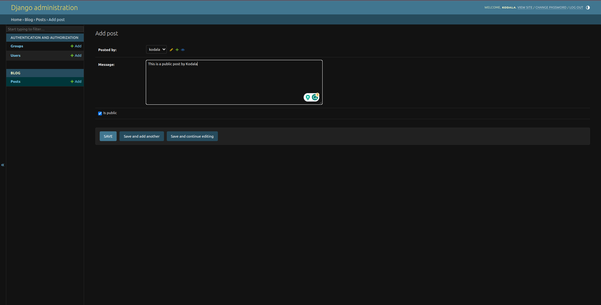
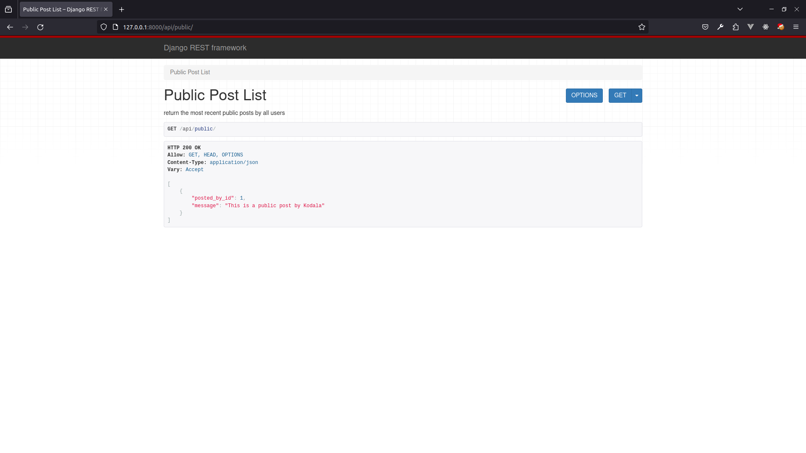

# Django REST Framework API

This project demonstrates the creation of a RESTful API using Django REST Framework (DRF).

## Setup

### Step 1: Installing Django REST Framework

Follow the instructions in the [DRF Quickstart Guide](https://www.django-rest-framework.org/tutorial/quickstart/) to install Django REST Framework.

### Step 2: Update Settings

Add `'rest_framework'` to the `INSTALLED_APPS` in `settings.py`:

```python
INSTALLED_APPS = [
    # ...
    'rest_framework',
    'blog',
    # ...
]
```

Update the permission model in `settings.py`:

```python
REST_FRAMEWORK = {
    'DEFAULT_PERMISSION_CLASSES': [
        'rest_framework.permissions.AllowAny',
    ],
}
```

### Step 3: Create Serializers

Create a new file named `serializers.py` with a serializer for the `Post` model:

```python
from rest_framework import serializers
from blog.models import Post

class PostSerializers(serializers.ModelSerializer):
    class Meta:
        model = Post
        fields = ('posted_by', 'message', 'created_at')
```

### Step 4: Define API Views

Define an API view in a separate file named `apiviews.py`:

```python
from rest_framework.views import APIView
from rest_framework.response import Response
from blog.models import Post
from .serializers import PostSerializers

class PublicPostList(APIView):
    def get(self, request):
        msgs = Post.objects.public_posts()[:5]
        data = PostSerializers(msgs, many=True).data
        return Response(data)
```

### Step 5: Update URLs

Update the `urls.py` file to include the path for the API view:

```python
from django.urls import path
from .apiviews import PublicPostList

urlpatterns = [
    # ... other paths
    path('api/public/', PublicPostList.as_view(), name='api_public'),
]
```

### Step 6: Test the API

Ensure the development server is running:

```bash
python manage.py runserver
```

Test the API by visiting http://127.0.0.1:8000/api/public/. Verify proper functionality and response.

## Screenshots

### Adding data through the admin pannel



### Testing the API endpoint


